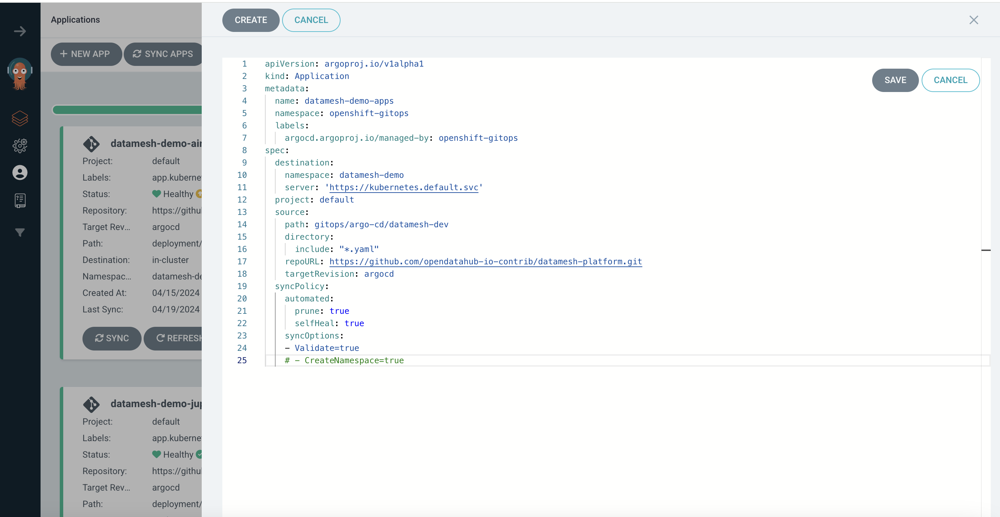

# Data Mesh deployment - Argo CD:

Argo CD is a declarative, GitOps continuous delivery tool for Kubernetes.GitOps can be considered an evolution in Infrastructure as Code (IaC) that uses Git as the version control system for infrastructure configurations. IaC often follows a declarative approach to infrastructure management by defining the desired state of the system and tracking the system’s actual state.

Argo CD follows the GitOps pattern of using Git repositories as the source of truth for defining the desired application state. 

Argo CD automates the deployment of the desired application states in the specified target environments. Application deployments can track updates to branches, tags, or pinned to a specific version of manifests at a Git commit. 

Argo support the Kubernetes manifests can be specified in the following kubernete deployments

-  kustomize applications
-  helm charts.

**Kustomize** is currently used for datamesh deployment, **helm chart** work in progress will be used in the future. 

# Deployment instruction :

# Prerequisites 

**Openshift 4.12**
**Red Hat Argo CD operator** must be installed on the openshift platform.


# clone Git repo 

```bash
git clone git@github.com:opendatahub-io-contrib/datamesh-platform.git
```
# Prepare keycloak realm 

keyCloak SSO used as the authendication framework for Airflow, Trino and OpenMetaData. To prepare keycloak realm , client ids and user credentials for Airflow , Trino, OpenMetadata , edit **generate_realm_config.sh** as shown below and run the script . make sure that commit the updated realm configuration file to github before run argocd application creation. 

```bash
export NAMESPACE=<"namespace">
export HOST_URL=<"openshift hostname">
./datamesh-platform/deployment/keyclaok/kustomize/generate_realm_config.sh
```

Navigate to /gitops folder and run the following OC command to create applicaiton which will trigger deployment of all datamesh components

```bash
cd /datamesh-platform/gitops
oc apply -f application.yaml 
```

other option, login to Argo CD application and create application by copy the contents from application.yaml


