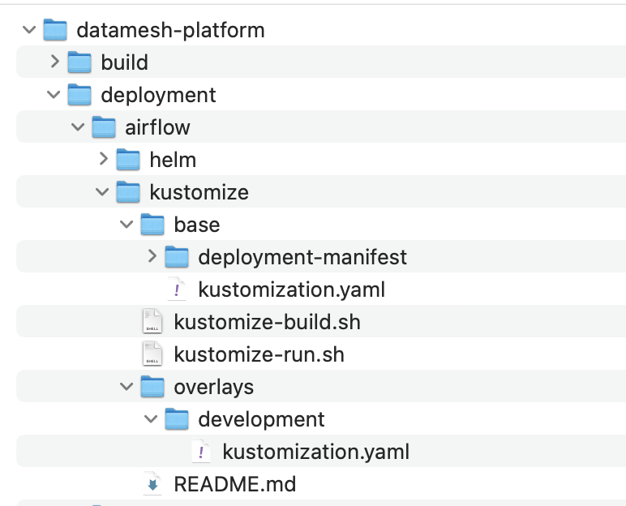

# kustomize for customization of Data Mesh pattern deploymnts:

The open source utility Kustomize has a variety of uses for the modification of Kubernetes YAML files. It can be used either before a deployment to generate a new file to be applied to the cluster, or it can be used directly by the OC (or kubectl) command to apply dynamically patched resources to the cluster. Central to the use of Kustomize is the management of a kustomization.yaml file that refers to the Kubernetes resources to be deployed to the cluster. In addition to applying a set of files to the cluster with a single command, the kustomization.yaml file can contain text replacement specifications to be applied to the YAML files to which it refers.

The following are the bare minimum compoments required to build Data Mesh pattern and deploy datamesh patterb.

1. [Airflow ] (https://airflow.apache.org/)

2. [Trino ] (https://trino.io/docs/current/)

3. [MinIo ] (https://min.io/)

4. [OpenMetaData ] (https://docs.open-metadata.org/)

5. [SuperSet ] (https://superset.apache.org/)

6. [Jupyter NoteBook ] (https://jupyter.org/)




# Deployment instruction :

Note : This is just for development purpose ,  not for prodction use. 

# Prerequisites 

**[Kustomize ] (https://kubectl.docs.kubernetes.io/installation/kustomize/).** Download Kustomize, if you don't have it from here.

**Openshift 4.X**

The main objective of the Data mesh deployment is to deploy all components in a few minutes by executing a simple script.

Each Data Mesh component has its own deployment manifest(s) in its own directory in the **deployment/<componnent>/Kustomize/Base and Overlay**folder as shown in the above screen shot. You can deploy all Data Mesh components in one shot by executing "datamesh-deploy.sh" or you can deploy individual compoent by executing script "kustomize-run.sh" which is located on its own folder.

```bash
git clone git@github.com:opendatahub-io-contrib/datamesh-platform.git
```
# Deploy complete Data Mesh components 

Navigate to the Data Mesh cloned directory **"cd /datamesh-platform/deployment"** and execute "datamesh-deploy.sh". By default , deployment will use datamesh-demo as default namespace name and create new name space in openshift. Changing name space,  edit "datamesh-deploy.sh" environment variable to the namespace name that need to be change
    **export NAMESPACE=<your name space>**

```bash
./datamesh-deploy.sh
```

# Deploy individual Data Mesh components. 
 
 An individual Data Mesh compoent can be deployed by executing **"kustomize-run.sh"** script which is located on its own folder. This script use **"Datamesh-demo"** as a default namespace. If namespace need to be changed , script need to be changed to the prefered namespace. 
    replace the following to change namespce in "kustomize-run.sh"
    ---
    --
      **OC_TOKEN="${OCP_TOKEN:-datamesh-demo}"**
    ---


