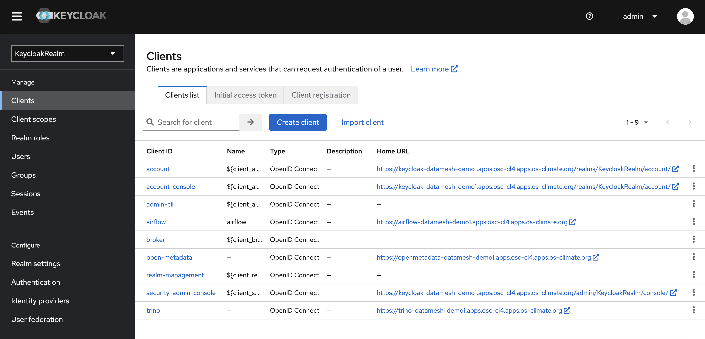
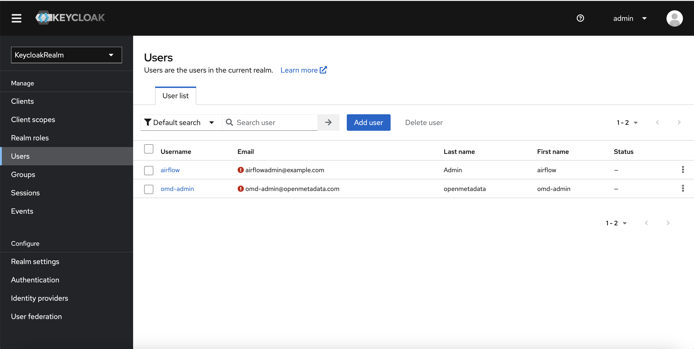
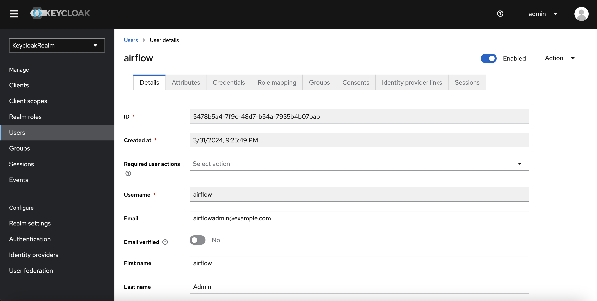
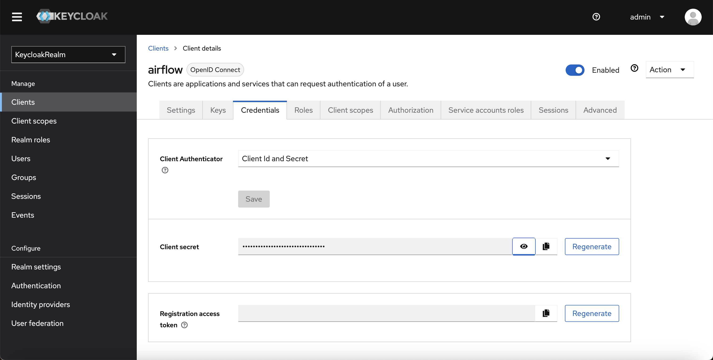
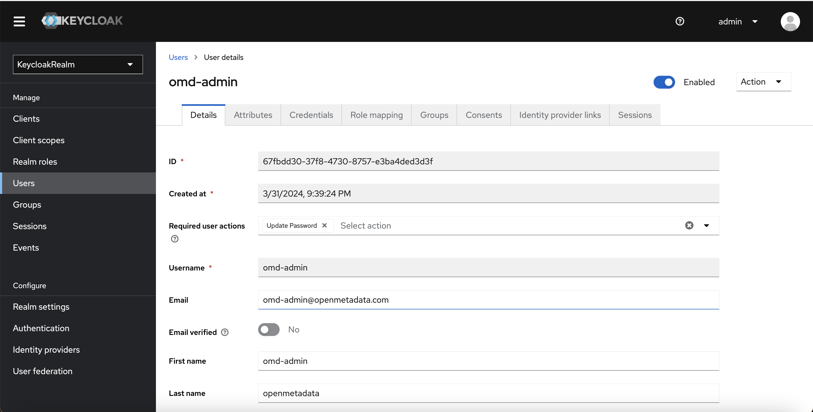

# kustomize for customization of Data Mesh pattern deploymnts:

The open source utility Kustomize has a variety of uses for the modification of Kubernetes YAML files. It can be used either before a deployment to generate a new file to be applied to the cluster, or it can be used directly by the OC (or kubectl) command to apply dynamically patched resources to the cluster. 

Central to the use of Kustomize is the management of a kustomization.yaml file that refers to the Kubernetes resources to be deployed to the cluster. 

In addition to applying a set of files to the cluster with a single command, the kustomization.yaml file can contain text replacement specifications to be applied to the YAML files to which it refers.

The following are the bare minimum compoments required to build Data Mesh pattern and deploy datamesh pattern.

1. [Airflow ] (https://airflow.apache.org/)

2. [Trino ] (https://trino.io/docs/current/)

3. [MinIo ] (https://min.io/)

4. [OpenMetaData ] (https://docs.open-metadata.org/)

5. [SuperSet ] (https://superset.apache.org/)

6. [Jupyter NoteBook ] (https://jupyter.org/)


# Deployment instruction :

Note : This is just for development purpose ,  not for prodction use. 

# Prerequisites 

**[Kustomize ] (https://kubectl.docs.kubernetes.io/installation/kustomize/).** Download Kustomize, if you don't have it from here.

**Openshift 4.12**

The main objective of the Data mesh deployment is to deploy all components in a few minutes by executing a simple script.

Each Data Mesh component has its own deployment manifest(s) in its own folder in the **deployment/<component>/Kustomize/Base and Overlay** folder as shown in the above screen shot. You can deploy all Data Mesh components at once by executing "datamesh-deploy.sh" or can deployed as an individual component by executing script **"kustomize-run.sh"** which is located in its own folder. 

Deployment manifests are structured based on the Kustomize standard. All baseline deployment artifacts are placed into folder **deployment/<datamesh-componet>/kustomize/base/deployment-manifest and environment specific manifests are placed into **../overlay/<environment-development/test/prod>** 


# clone Git repo 

```bash
git clone git@github.com:opendatahub-io-contrib/datamesh-platform.git
```
# Deploy complete Data Mesh components 

Navigate to the Data Mesh cloned directory **"cd deployment"** and run "datamesh-deploy.sh". This required Openshift host url and login credentials and these informations are in **config.properties** file located in the deployment directory.  By default , deployment will use datamesh-demo as default namespace, if not specified in the config.properties

Before starting deployment script , the following steps must be done, otherwise all pods will be in error states.

# 1. **openshift credential and namespace**
   update openshift credentials that specific to your environment to **config.properties** file

# 2. **prepare KeyCloak realms** and clientId template specific to datamesh components. You can find keyclack realm 
   template file in **Keycloak/kustomize/deployment-manifest/realm/realm-config.json**. If you don't find it.
   modify **Keycloak/kustomize/generate_realm_config.sh** to add specific to your namespace , keycloak client token and user/group and then run the script to generate keycloak realm configurtation for **"Trino, airfkow and OpenMetaData"**. The generate_realm_config.sh generate keycloak realm with client for  **Trino , Airflow and openmetadata** components. 
   
   Here is the sample realms generated by generate_realm_config.sh

   

   

   
    
   

   

# 3. Deploy complete all Data Mesh components 

```bash
./datamesh-deploy.sh
```

# Deploy individual Data Mesh components. 
 
 An individual Data Mesh compoent can be deployed by executing **"kustomize-run.sh"** script which is located on its own folder. This script use **"Datamesh-demo"** as a default namespace. If namespace need to be changed , config.properties file need to be changed to the prefered namespace and openshift login credentials

 Example to run airflow component 

```bash
cd datamesh-cop/datamesh-platform/deployment
./setenv.sh
./airflow/kustomize/kustomize-run.sh
```


